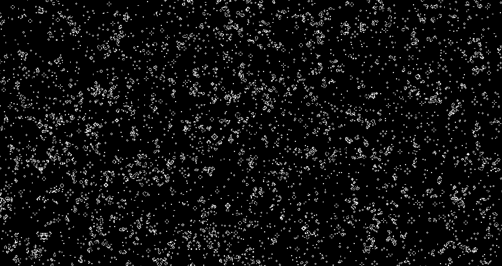

---
hide:
  - navigation
  - toc
---

# :wave: **Hello, World!**

### _A long time ago, in a universe of infinite cells, where [Gliders](http://www.catb.org/hacker-emblem/faqs.html) travel endlessly..._

<figure markdown>
  {.maxH500 loading=lazy .skip-lightbox }
  <figcaption style="font-size: 0.8em; text-align: center; color: gray;">
    An artistic representation of patterns from <a href="https://en.wikipedia.org/wiki/Conway%27s_Game_of_Life" target="_blank">Conway's Game of Life</a>.
  </figcaption>
</figure>

---

## **Welcome to my world, Guest [1337](https://en.wikipedia.org/wiki/Leet)!**

- ### :black_nib: **[Blog](pages/blog/index.md)**
    > In my blog, you can find insights and some helpful content.

- ### :martial_arts_uniform: **[Practice](pages/writeups/index.md)**

    > Writeups of learning, sharpening skills, and cyber prowess.

- ### :books: **[Codex](pages/codex/index.md)**

    > For some reference, explore my Codex, you can find bits of knowledge there.

- ### :toolbox: **[Toolbox](pages/toolbox/index.md)**

    > A collection of powerful tools for cybersecurity in general.

- ### :abc: **[Glossary](pages/glossary/index.md)**

    > A good reference of key terms in cybersecurity, hacking, and related fields.
