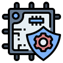
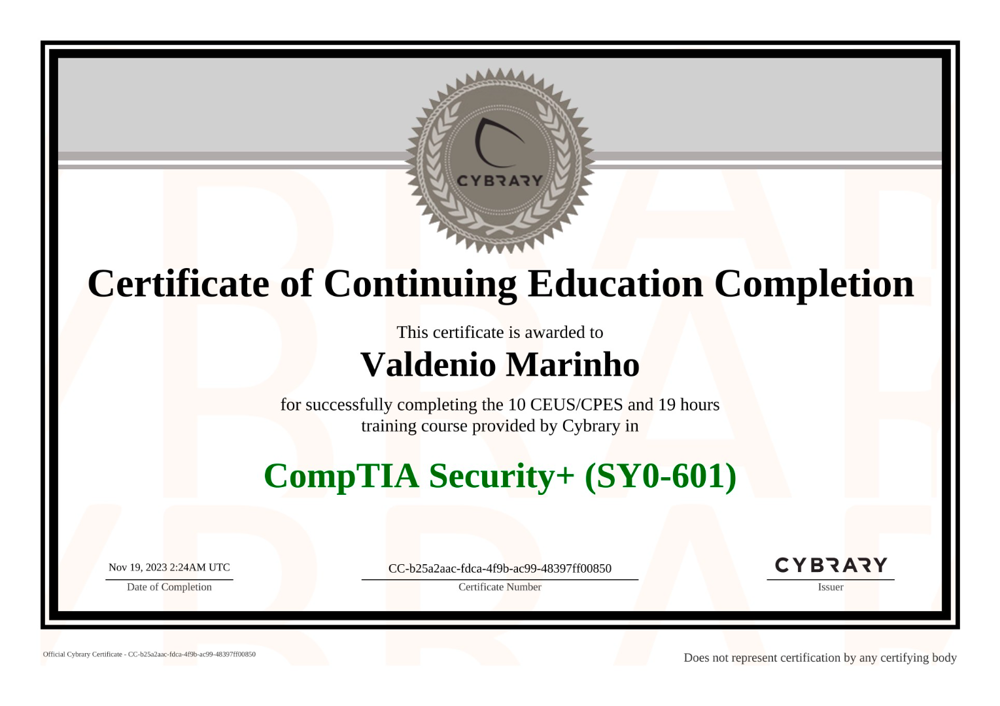
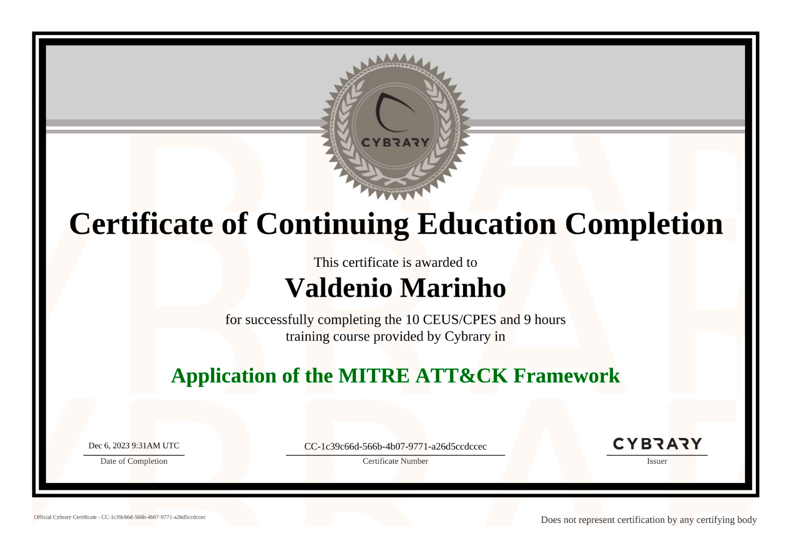
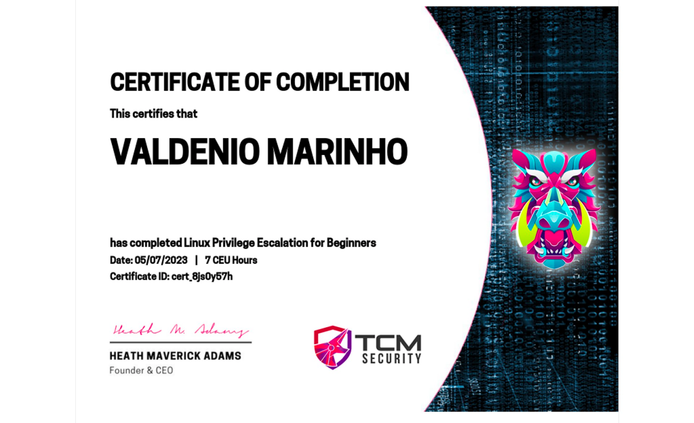
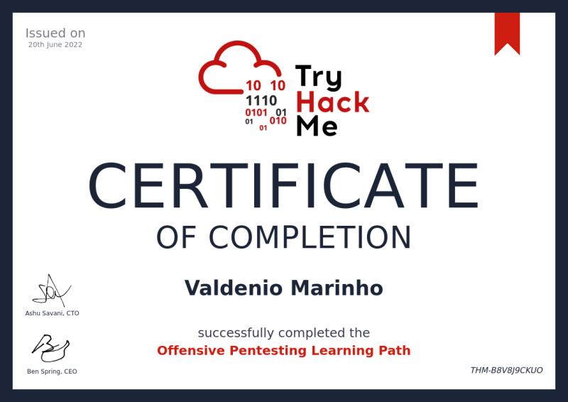
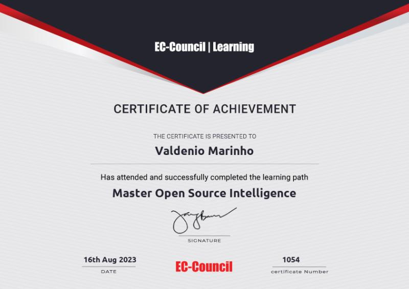
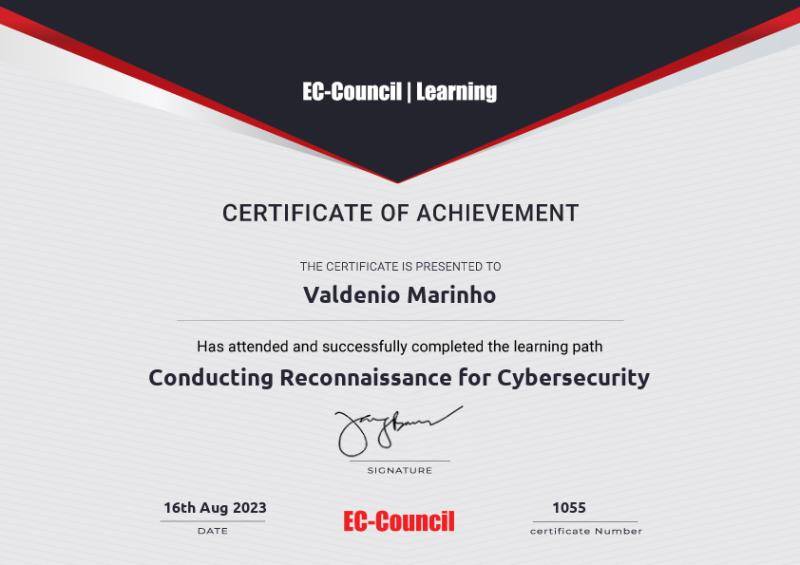

---
hide:
  - navigation
  - toc
---

# Valdenio Marinho A.K.A. "**0xrh0d4m1n**"
## _SOC Cybersecurity Analyst_

[:fontawesome-brands-x-twitter:](https://x.com/0xrh0d4m1n){ .md-button } [:simple-linkedin:](https://www.linkedin.com/in/0xrh0d4m1n){ .md-button } [:simple-github:](https://github.com/0xrh0d4m1n){ .md-button } [:simple-telegram:](https://t.me/Oxrh0d4m1n){ .md-button } [:simple-discord:](https://discord.com/users/272990907307917313){ .md-button }   

{ .skip-lightbox }

---

## :compass: **Executive Summary**

Passionate about cybersecurity, my fascination with hacking began in my youth and has remained a
constant drive throughout my career. My journey started with an electrical engineering
background, where I acquired a solid foundation in electronics and microcontrollers. Embracing
the typical greatest IT minds path and following the path of many IT pioneers, I left academia
to carve out my own path, a decision fueled by a desire to apply the robust knowledge base I had
acquired. This led me to web development.

Transitioning into web development, I rapidly evolved into a Full Stack Web Developer, a
transformation made possible by the unwavering and invaluable support of great mentors around the
world. My curiosity soon led me to the cutting-edge technology of blockchain and NFTs, where I
was actively involved in innovative projects. However, it was the intricate and dynamic field of
cybersecurity that truly captivated me, prompting a deep dive into cryptography and a range of
security disciplines.

I have completed top-tier courses on leading cybersecurity platforms, staying ahead of industry
trends and mastering the most current practices. My education has been greatly enhanced by
hands-on experience in advanced labs, where I've tackled real-world scenarios to hone my skills.
Additionally, I have extensively practiced advanced bug bounty hunting techniques, participating
in numerous platforms worldwide. This comprehensive, practical experience has not only broadened
my technical expertise but also instilled a profound appreciation for the ever-evolving
landscape of knowledge in cybersecurity. I am committed to continuing this exhilarating journey,
always learning, always adapting, and always pushing the boundaries of what's possible in the
digital world. Today, I stand with a profound understanding of cybersecurity, shaped by extensive
practice and the humility gained from the [Dunning-Kruger effect](https://en.wikipedia.
org/wiki/Dunning%E2%80%93Kruger_effect). I am eager to continue this journey, constantly
expanding my knowledge and expertise.

---

## :toolbox: **Skills & Expertise**

??? abstract "Technical Skills"

    

      -   ### **Penetration Testing**

        { .skip-lightbox }

        ---

        Simulating cyber attacks to identify and exploit security vulnerabilities.

      - ### **Risk Assessment**

        { .skip-lightbox }

        ---

        Evaluating and prioritizing potential risks to minimize the impact.

      - ### **Vulnerability Assessment**

        { .skip-lightbox }

        ---

        Systematically identifying and quantifying security vulnerabilities in systems.

      - ### **Security Operations**

        { .skip-lightbox }

        ---

        Overseeing and maintaining a secure operational computing environment.

      - ### **Incident Response**

        { .skip-lightbox }

        ---

        Effectively managing and mitigating cyber incidents to minimize damage and recovery time.

      - ### **Cyber Threat Intel**

        { .skip-lightbox }

        ---

        Analyzing and interpreting information about potential cyber threats to prevent attacks.

    

??? note "Programming Languages"

    

      - ### **Nim**

        { .skip-lightbox }

        ---

        I'm still exploring new languages like Nim, trying to adeptly leverage Nim's efficiency and expressive syntax to craft secure, high-performance applications with a focus on cybersecurity tooling.

      - ### **JavaScript**

        { .skip-lightbox }

        ---

        My JavaScript expertise come from a long time, my background as developer made me possible to perform penetration testing on web applications, identifying and exploiting client-side vulnerabilities.

      - ### **Python**

        { .skip-lightbox }

        ---

        My Python skills are honed for scripting powerful cybersecurity tools and also automating complex security tasks.

      - ### **Shell Script**

        { .skip-lightbox }

        ---

        I'm constantly using ShellScript for automating security processes and orchestrating system-level tasks on Unix/Linux platforms.

      - ### **Rust**

        { .skip-lightbox }

        ---

        With my proficiency in Rust, I delve into low-level programming to create my own high-performance cybersecurity tools.

      - ### **Assembly**

        { .skip-lightbox }

        ---

        My knowledge of Assembly allows me to perform meticulous analysis and reverse engineering of malware through tools like Ghidra.

    

??? tip "Tools & Technologies"

    

      -   ### **Burp Suite**

        { .skip-lightbox }

        ---

        Skilled in utilizing Burp Suite for comprehensive web application security testing and uncovering critical vulnerabilities.

      - ### **OWASP Zed Attack Proxy**

        { .skip-lightbox }

        ---

        Proficient with OWASP ZAP for automated security scanning and targeted manual testing of web apps.

      - ### **Greenbone OpenVAS**

        { .skip-lightbox }

        ---

        Experienced in deploying OpenVAS to scan and evaluate the security of network services and systems.

      - ### **Tenable Nessus**

        { .skip-lightbox }

        ---

        Well-versed in using Nessus to identify a wide range of vulnerabilities and security issues within company infrastructure.

      - ### **Qualys, Inc.**

        { .skip-lightbox }

        ---

        Adept at leveraging Qualys for vulnerability management and securing web applications and cloud environments.

      - ### **Rapid7 Metasploit**

        { .skip-lightbox }

        ---

        Knowledgeable in applying Metasploit for developing and executing exploit code to assess network defenses.

      - ### **Nmap**

        { .skip-lightbox }

        ---

        Capable of conducting advanced network discovery and security auditing with Nmap to reveal potential vulnerabilities.

      - ### **Wireshark**

        { .skip-lightbox }

        ---

        Experienced in packet analysis with Wireshark, monitoring and diagnosing network traffic for security investigations.

      - ### **Ghidra**

        { .skip-lightbox }

        ---

        Utilize Ghidra for reverse engineering, dissecting malicious code to understand and mitigate attack vectors.

    

---

## :scroll: **Certifications**

??? success "Fortinet"

    

      - ### **Fortinet Cybersecurity Associate**

        ---
        

      - ### **Fortinet Cybersecurity Fundamentals**

        ---
        

      - ### **Fortinet Network Security Level 3**

        ---
        

      - ### **Fortinet Network Security Level 2**

        ---
        

      - ### **Fortinet Network Security Level 1**

        ---
        

    

??? success "Google"

    

      - ## **Cyber Professional Certification**

        ---
        

      - ## **Foundations of Cybersecurity**

        ---
        

      - ## **Manage Security Risks**

        ---
        

      - ## **Networks and Network Security**

        ---
        

      - ## **Linux and SQL**

        ---
        

      - ## **Assets, Threats and Vulnerabilities**

        ---
        

      - ## **Detection and Response**

        ---
        

      - ## **Cybersecurity Tasks with Python**

        ---
        

      - ## **Preparation for Cybersecurity Jobs**

        ---
        

    

??? success "Cybrary"

    

      - ## **Offensive Penetration Testing**

        ---
        

      - ## **Advanced Penetration Testing**

        ---
        

      - ## **Penetration Testing**

        ---
        

      - ## **Penetration Testing & Ethical Hacking**

        ---
        

      - ## **OWASP TOP 10**

        ---
        

      - ## **CompTIA Security+**

        ---
        

      - ## **Cyber Kill Chain Framework**

        ---
        

      - ## **MITRE ATT&CK Framework**

        ---
        

      - ## **Security Operations Analyst (SOC)**

        ---
        

      - ## **CompTIA Linux+**

        ---
        

      - ## **System Administrator**

        ---
        

      - ## **CompTIA A+**

        ---
        

    

??? success "TCM Security"

    

      - ## **Web Application Penetration Testing**

        ---
        

      - ## **API Hacking**

        ---
        

      - ## **Ethical Hacking**

        ---
        

      - ## **Movement, Pivoting, Persistence**

        ---
        

      - ## **Privilege Escalation Windows**

        ---
        

      - ## **Privilege Escalation Linux**

        ---
        

      - ## **External Pentest Playbook**

        ---
        

      - ## **Governance, Risk and Compliance**

        ---
        

      - ## **Open Source Intelligence (OSINT)**

        ---
        

    

??? success "Try Hack Me"

    

      - ### **Offensive Pentest**

        ---
        

      - ### **CompTIA Pentest+**

        ---
        

      - ### **JR Pentest**

        ---
        

    

??? success "Other"

    

      -   ### **Palo Alto Networks Cybersecurity Foundation**

        ---
        

      - ### **EC Council Master OSINT**

        ---
        

      - ### **EC Council Reconnaissance**

        ---
        

      -   ### **API Penetration Testing**

        ---
        

    

---

## :briefcase: **Professional Experience**

-   ## **Nexusguard**

    ### _SOC Cybersecurity Analyst_

    #### _Remote, Singapore_

    #### 2024 - Present

    ***

    - Monitor and analyze security events across enterprise systems using SIEM tools to detect, investigate, and respond to potential threats.
    - Collaborate with incident response teams to mitigate risks and contain security incidents effectively.
    - Conduct in-depth analysis of alerts to identify patterns indicative of cyber threats, enhancing detection and response capabilities.
    - Generate detailed reports and presentations on threat intelligence findings, sharing actionable insights with stakeholders to fortify organizational security posture.
    - Leverage Nexusguard's proprietary DDoS mitigation technologies to protect client infrastructures from volumetric, protocol-based, and application-layer attacks.

-   ## **HackerOne, Bugcrowd, Intigriti**

    ### _Cybersecurity Researcher_

    #### _Remote, Worldwide_

    #### 2023 - Present

    ***

    - Successfully identified and reported a significant security vulnerability through HackerOne's Bug Bounty Program.
    - Utilized advanced security testing platforms to perform comprehensive vulnerability assessments, identifying critical security flaws and weaknesses.
    - Analyzed and reported findings from vulnerability discovery tools to provide actionable insights and recommendations for enhancing system security.
    - Collaborated with cross-functional teams to address identified vulnerabilities, developing and implementing effective remediation strategies.

-   ## **Freelancing**

    ### _Fullstack Web Developer_

    #### _Remote, Worldwide_

    #### 2018 - 2022

    ***

    - Designed and developed scalable, high-performance web applications using a range of technologies including HTML, CSS, JavaScript, and also frameworks.
    - Managed software development lifecycle from initial planning and design to deployment and maintenance, ensuring project delivery on time and within budget.
    - Integrated third-party APIs and services to enhance application functionality and user experience, while maintaining high standards of code quality and security.
    - Conducted thorough testing and debugging to identify and resolve issues, ensuring optimal performance and reliability of web applications.

---

## :fontawesome-solid-graduation-cap: **Education**

-   ### **B.Tech in Cybersecurity**

    #### _University X_

    #### 2023 - 2025

    ***
  
- ### **Electrical Engineering**

    #### _University Z_

    #### 2014 - 2016

    ***

---

## :package: **Projects**

-   ### **0xh3x73rs Team**

    #### _Founding Member_

    #### 2023 - 2024

    ***

    - Co-founded a bug bounty team, demonstrating leadership and initiative in the cybersecurity field.
    - Collaborated with team members to identify and report vulnerabilities in various web applications.
    - Contributed to the successful identification of significant security flaws.
    - Developed expertise in vulnerability research and reporting methodologies.

---

## :trophy: **Achievements**

-   #### :star: 1st Place - CTF Hacker Talent of the Month (HackerOne)
-   #### :star: Top 1% - Hacker Rankings (TryHackMe)

---

## :speech_balloon: **Languages**

-   #### :flag_us: **English**: `Fluent`
-   #### :flag_br: **Portuguese**: `Fluent`
-   #### :flag_es: **Spanish**: `Conversational`

---

## :arrow_down: **Download Resume**
If you want to save my resume, you can download it below, feel free to contact me any time!

[:material-file-download: English Resume ](../../assets/docs/resume-enus.pdf){ .middle .md-button .btn-outline-success }

[:material-file-download: Portuguese Resume ](../../assets/docs/resume-ptbr.pdf){ .middle .md-button .btn-outline-success }
